# Online MD - Health Care System for DJCSI CodeShastra 4.0 (2018)

In a world of scarcity, saving lives is thin on the ground. Medical resource deficiency is a severe issue in India. Hundreds of patients lose their lives due to lack of access to apt information and amenities. Circumstances as such greatly emphasise the need for a centralised information reserve of medications, equipment, personal records and medical professionals available that is accessible and intelligible to anyone, at anytime and from anywhere. In such scenario our Online MD System helps the needy to get all the relevant and necessary information at one place which is an impactful solution to the critical problem mentioned above.
The application renders the databases available at all times, from all places and to each and everyone who is in need of this information. In other words, the System focuses on centralizing or bringing together all the information related to medical which is spread across the entire web at one place for the patients, doctors, pharmacists and every other individual in the field of medicine.
Following are the features which are incorporated in our System:
* Registering Chemists on our System with their geolocation and google spreadsheet link of their inventory, then using google spreadsheet API we will centralize all the decentralized spreadsheets to our E-commerce system and providing medicines to the patients and doctors at a reasonable rate and at the nearest location. 
* Map View of all the nearby hospitals, chemists, doctors with their live status of currently being open or close thus helping people to get to the right place in the urgent hour of need. 
* Live Streaming feature with doctors from the urban area to help our people as well as doctors from rural and remote areas. 
* SMS chat in English as well as local language for the villager to get details about nearby services and medical product availability using the data available in our system as well as a third-party source. 
* Giving other alternatives to a medicine using its generic name in the market as well as it nearby availability mentioned above. 
* Forum & chat with doctor registered on our system.

## Getting Started

* Once the Project is cloned, the project must be placed in the htdocs/www folder of your PHP Localhost (XAMPP or WAMP)
* The Required Database found in the assets folder must be imported into PHPmyAdmin databases of your localhost for running the project.
* The Project uses [Google Maps](https://developers.google.com/maps/documentation/javascript/), [Places](https://developers.google.com/places/) and [Sheet](https://developers.google.com/sheets/api/) API so you need to setup account on google cloud platform and get the required credential for the used APIs.
* Account on TextIt.in to use the TextIt Flow API for SMS chat.
### Setting up Live Stream.

* Create your account on EZ Web Player and Download Adobe Flash Media Live Encoder.
* Once you create a account on EZ Web Player you will get a RTMP Live Stream URL.
* Use that link in Adobe Flash Media Live Encoder as FMS URL and then connect and start recording the live stream video.
* Go to EZ Web Player Dash Board and Add a Video using RTMP Live Stream Option.
* Now your Live Stream is generated.

Link: [https://www.youtube.com/watch?v=gqiR5ibbYfI](https://www.youtube.com/watch?v=gqiR5ibbYfI)

### Prerequisites

* [Xampp PHP 5.6 or Above](https://www.apachefriends.org/download.html)
* [Adobe Flash Media Live Encoder](https://www.adobe.com/go/fmle)
* [EZ Web Player](http://www.ezwebplayer.com/)

## Demo
### Medical E-Store populated using Google SpreadSheet of Registered Chemist's Inventory
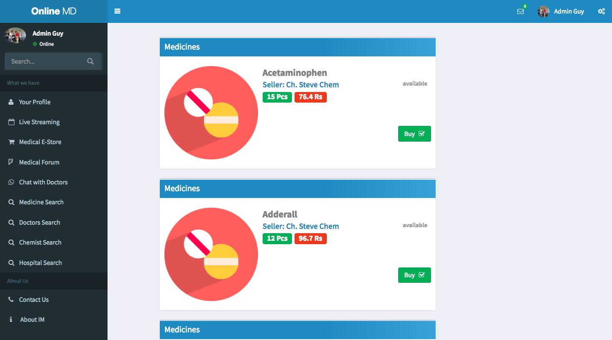

### Medical Forum
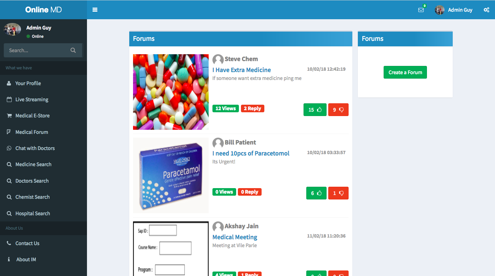

### Chat with Doctors
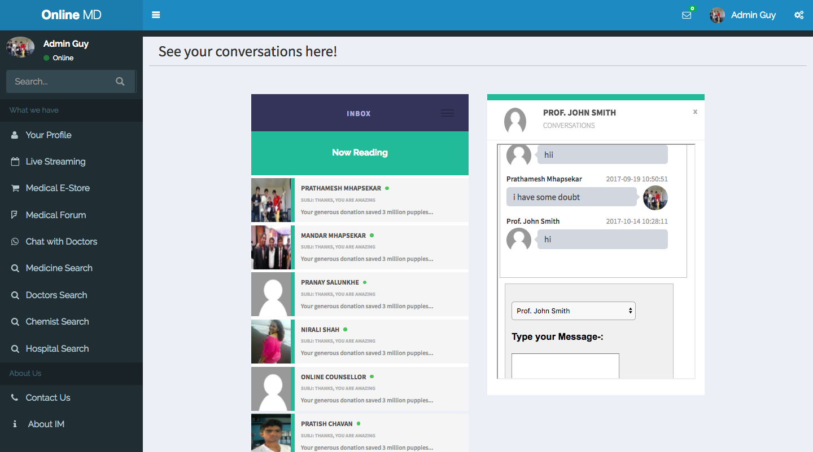

### Medicine Search using Generic medicine names suggesting different alternate manufacturer.
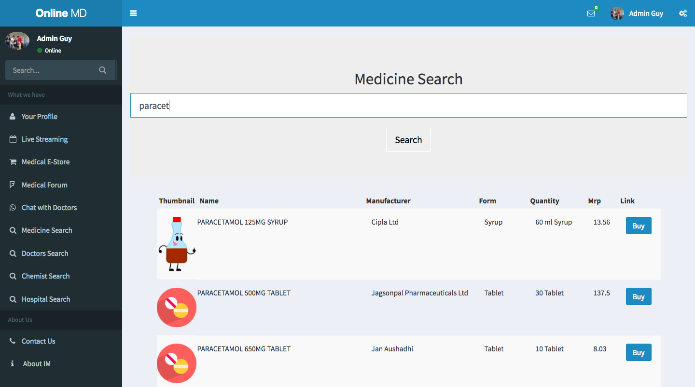

### Doctor Search with Ratings and current status
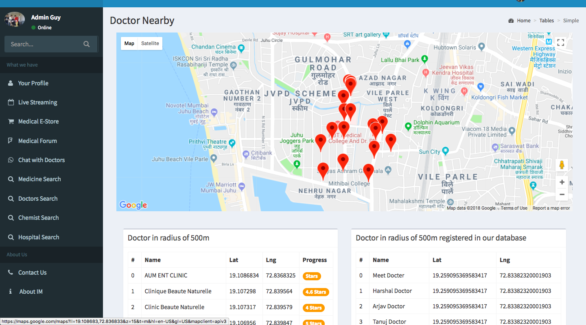

### Chemist Search with Ratings and current status
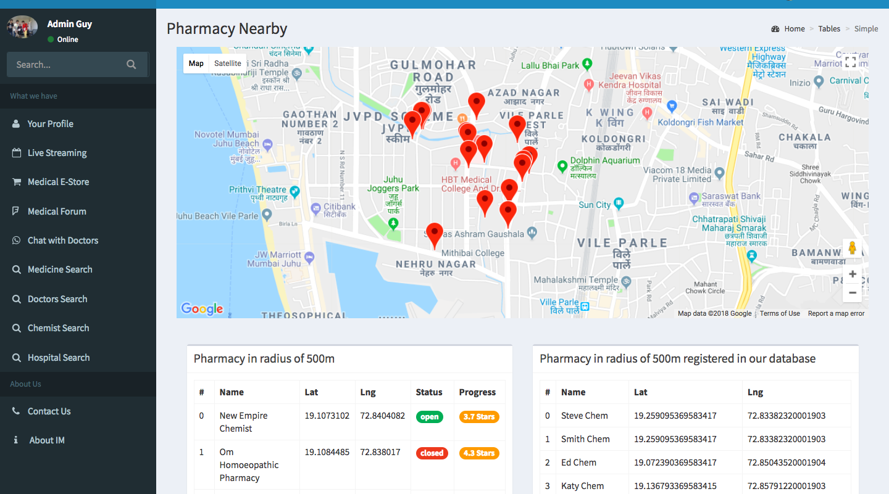

### Hospital Search
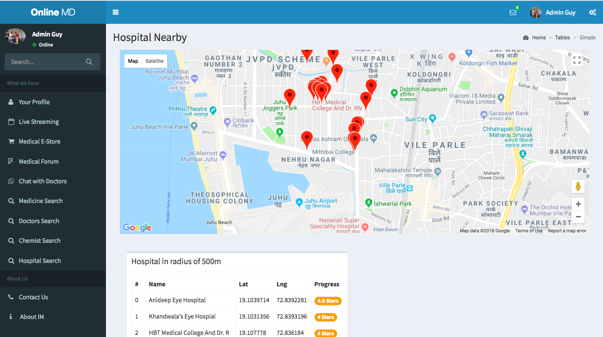

### SMS Based Medical Help
1                          |2                          |3                          |
:-------------------------:|:-------------------------:|:-------------------------:|
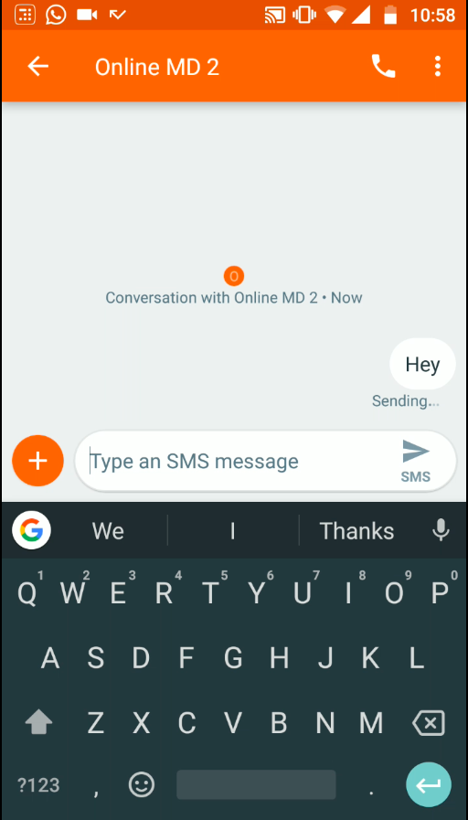  |  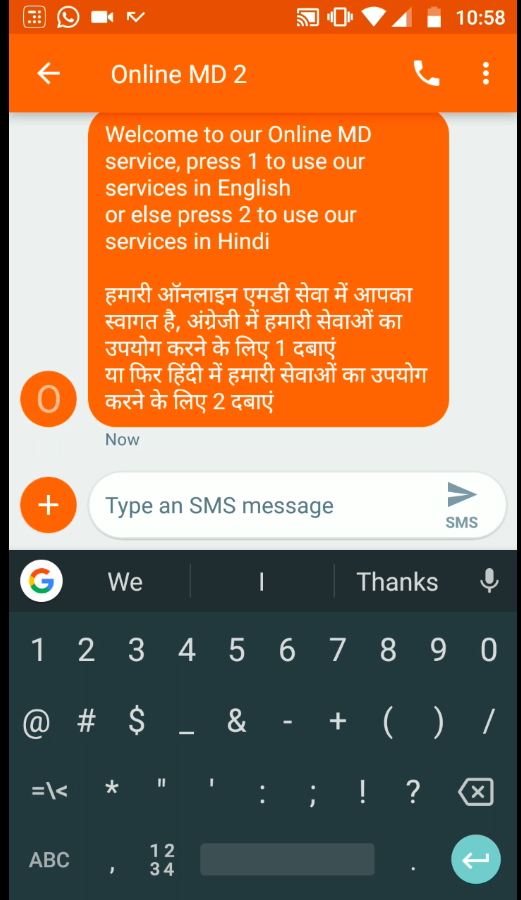  |  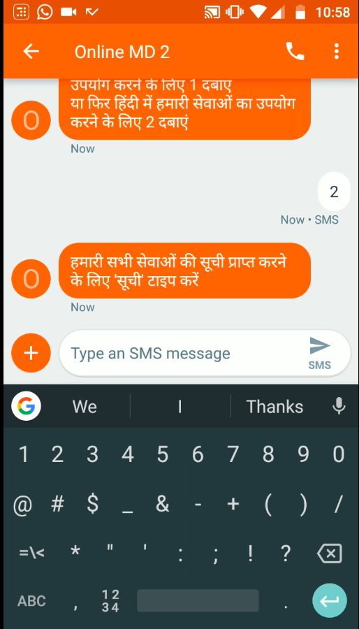 |

4                          |5                          |6                          |
:-------------------------:|:-------------------------:|:-------------------------:|
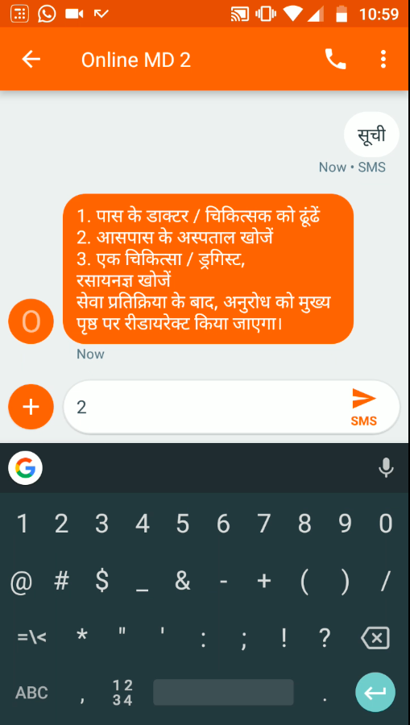  |  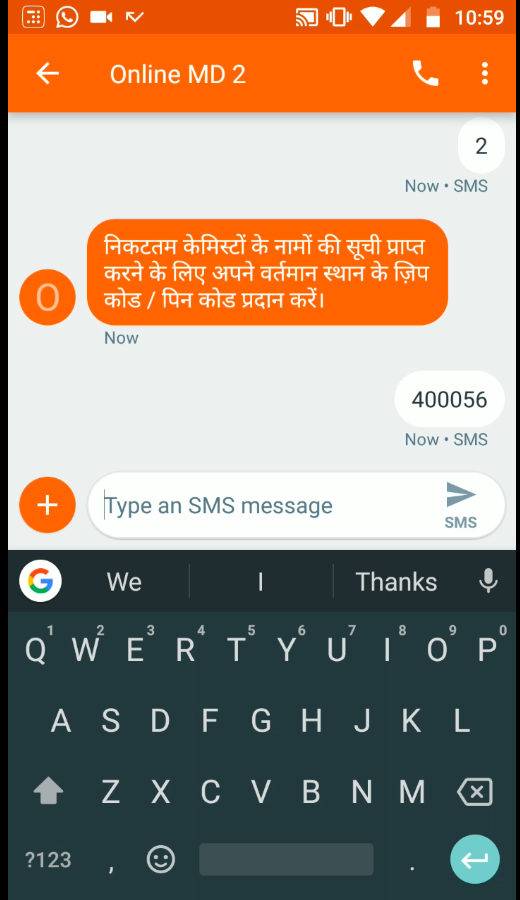  |  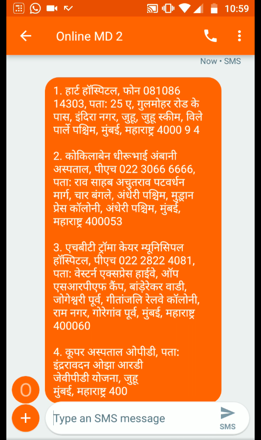  |

## Built With

* [EZ Web Player](http://www.ezwebplayer.com/)
* Admin LTE 2 Bootstrap Template
* Google [Map](https://developers.google.com/maps/documentation/javascript/) & [Places API](https://developers.google.com/sheets/api/) 
* Google [Sheet API](https://developers.google.com/sheets/api/)

## Authors

* **Prathamesh Mhapsekar** - [prathmesh36](https://github.com/prathmesh36)
* **Mandar Mhapsekar** - [mandar10](https://github.com/mandar10)
* **Raj Patel** 
* **Akshay Jain**

See also the list of [contributors](https://github.com/your/project/contributors) who participated in this project.

## License

This project is licensed under the MIT License - see the [LICENSE.md](LICENSE.md) file for details

